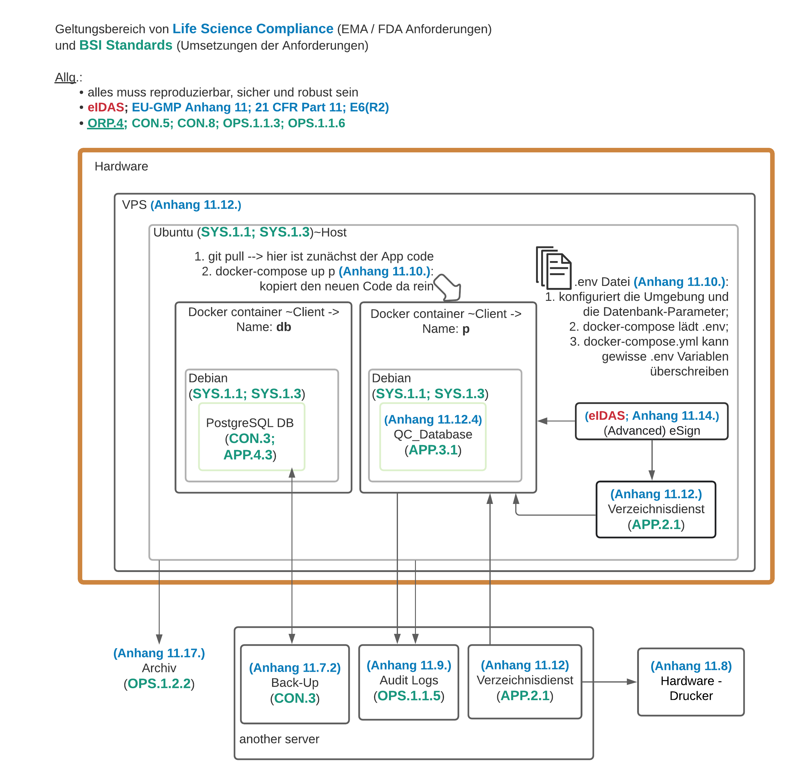

# What is Voy about?

A simple tool for the quality control of source documents.
Designed to fulfill the requirements of a compliant software in EU | Life Science respective to the GDPR.

## Table of Contents
- [Overview](#overview)
- [Quickstart](#quickstart)
- [Development](#development)
  - [Virtual env](#virtual-env)
  - [Assets](#assets)
  - [Mailing](#mailing)
  - [Database migrations](#database-migrations)
    - [Create migrations](#create-migrations)
    - [Apply migrations](#apply-migrations)
  - [Command Line Interface (CLI)](#command-line-interface-cli)
- [Deployment](#deployment)
  - [Deployment with Docker](#deployment-with-docker)
    - [Requirements](#requirements)
    - [Setup](#setup)
    - [Updating](#updating)
    - [Adapting the location of backups](#adapting-the-location-of-backups)
    - [Debugging](#debugging)
- [Advanced configuration](#advanced-configuration)
- [Voy in biological words (German)](#voy-in-biological-words-german)

# Overview

- build with: Python Flask
- software design pattern: Model-View-Controller (MVC)
- runs offline: `npm` downloads the JS packages and `parcel.js` bundles them, that they are executable in the project
- deploy it on a server with: `gunicorn`

# Quickstart
1. Run `cp .example.env .env` to create a basic configuration
2. Run `docker-compose up -d voy` to start your docker environment
3. Run `make db-init` to create the required database structure
4. Open [localhost:5000](http://localhost:5000/) to access the web-interface

Optional (for backups):
4. Run `cp ofelia.example.ini ofelia.ini` to create a basic configuration for the backups
5. Run `docker-compose up -d db-backup` to start the backup service and the scheduled backups

# Development
Voy is meant to be developed with the included docker setup. It comes with everything installed and setup to quickly get
the application running and start developing.

## Virtual env
A virtual environment (venv) is not needed to run the application. We recommend installing it nevertheless for a better
development experience.

- Run `make venv` to get the venv installed and setup
- Run `. venv/bin/activate` to enter it

## Assets
Assets, like JavaScript and CSS files, are bundled with the Node Package Manager (npm). For performance reasons we do
not offer a Docker container for working with the assets. We recommend installing `npm` locally on your system.

Run `npm run watch` for having your assets re-built when you change them

## Mailing
To check and verify outgoing e-mails from our app, the Docker setup includes a dummy SMTP server - Mailhog. It is
started together with the app. One can access it under [localhost:5001](http://localhost:5001/) and see sent mails from
our application there.

## Database migrations
To enable updates for live instances of our software, it is crucial to have database migrations. Database migrations
offer a way to adapt an existing databases so that they are on par with the updates made in the code. All this while
preserving the data contained.

Here is how to work with them:

### Create migrations
**Attention**: The library we are using, **Flask-Migrate**, internally uses Alembic, which has some **limitations** when
it comes to detecting changes.
**Read more** about that here: https://alembic.sqlalchemy.org/en/latest/autogenerate.html#what-does-autogenerate-detect-and-what-does-it-not-detect

- Run `flask db migrate -m "<Migration Message>"`. Make sure to enter a meaningful `<Migration Message>`.
- Add the created migration(s) under `migrations/versions` to git.
- Commit your changes to the database model together with the migrations.

### Apply migrations
When pulling changes to the database, migrations might need to be run to have your local instance keep up with the code.

Run `make db-upgrade` to execute all pending migrations.

## Command Line Interface (CLI)
This app comes with a custom Command Line Interface (CLI). To use it, you first need to install the app as a package:

- Enter you virtual env with `. venv/bin/activate`
- Run `pip3 install -e .` to install the app as a python package in the virtual env
- You can now run commands with the `voy` command.

# Deployment

## Deployment with Docker
This app includes a Docker setup that can be used for live deployment.

Here is how to use it:
### Requirements
- Docker
- Docker-Compose

### Setup
1. Configuration
   1. Run `cp .example.env .env` to create a basic configuration
   2. Run `cp ofelia.example.ini ofelia.ini` to create a basic configuration for the backups
   3. Adapt the configuration to your needs.
2. Starting the services
   1. Run `docker-compose up -d voy` to start your docker environment
   2. Run `docker-compose up -d db-backup` to start the backup service and the scheduled backups
3. Run `make db-init` to create the required database structure

You can now access the web-interface under: [localhost:5000](http://localhost:5000/)

### Updating
The setup relies on mounting the code into the container, so code changes are relatively easy to propagate.
However, when the python dependencies change, a rebuild of the Docker image is necessary.

- Has your `requirements.txt` changed?
  1. Run `docker-compose build` to have Docker update the image with the new dependencies.
  2. Recreate the running containers with `docker-compose up -d voy`

- Only changes in code?
  1. If you changed your static files run: `npm run build`
  2. Gunicorn does not reload your code, so you need to restart your `voy` service: `docker-compose restart voy`

### Adapting the location of backups
The location where the backups are stored can be adapted in the `.env` file with the `DB_BACKUP_DIR` variable.

### Debugging
To debug gunicorn you can add the `--preload` flag to it. This will give you stack traces to errors that occurred.
The `--preload` flag is now set by default when using the Docker-Compose setup.

To see the logs of the `voy` service run `docker-compose logs -f voy`.

# Advanced configuration
- the logging style is inside `logging.yaml`
- the app default env is "development". Set it to "production" with `export FLASK_ENV=production` before running it with `flask run`

# Voy in biological words (German)
Ein leerer *Server* ist wie eine Zelle, die nur aus einer Plasmamembran mit Signalproteinen besteht.
*ssh* entspricht diesen Proteinen auf der Plasmamembran, die Signale entgegen nehmen.

Um die Zelle mit Grundfunktionen auszustatten, importieren wir Ribosome und elementare Netzwerkstrukturen, was in Form des Aufsetzen des Betriebssystem *Ubuntu* erfolgt.

Das *Docker Image*, welches wir in die Zelle importieren können, entspricht der mtDNA (mitochondriale DNA), wohingegen diese mtDNA ohne das Mitochondrium exisitiert, sondern diese durch die Translation erstmalig mit allen Funktionen bildet.

*Docker Container* sind nun wie das Mitochondrium. Sie sind eine Zelle in einer größeren Zelle (so die Endosymbiontentheorie).

Jetzt können aber x-beliebig viele Mitochondrien in der Zelle existieren. Damit man mit ihnen kommunizieren kann, muss man deren entsprechende Membranproteine ansprechen, was *Port-binding* enstpricht
